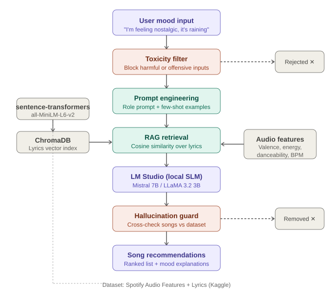

# RFC — Music Mood Matcher
**Team: The Overfitters**

---

## 1. Introduction

Music has always been deeply tied to human emotion, yet most streaming platforms recommend songs based on listening history or genre preferences rather than how a user feels in a given moment. Music Mood Matcher addresses this gap by allowing users to describe their current mood in natural language and receive personalized song recommendations with explanations of why each song fits their emotional state. The application leverages LLMs combined with retrieval-augmented generation (RAG) to produce grounded, explainable and context-aware music suggestions.

---

## 2. Problem Definition

### Input / Output
- **Input:** A natural language mood description (e.g., *"I'm feeling nostalgic and it's raining outside"*)
- **Output:** A ranked list of songs with explanations of why each song matches the mood

### Task Type
The task combines semantic retrieval (RAG over song lyrics) with natural language generation (LLM explanation). It can be framed as a recommendation task with generative output.

### Constraints & Challenges
- Mood is subjective — the same description can map to different songs for different users
- The local SLM may hallucinate song titles or artists not present in the dataset
- Inappropriate user inputs must be filtered before processing

---

## 3. State of the Art

Several existing approaches tackle mood-based music recommendation:

- **Spotify's Valence Model** — uses audio features (energy, danceability, valence) for mood inference, but lacks natural language input [Spotify Audio Features API]
- **MoodPlay (Ferwerda et al., 2016)** — maps Russell's circumplex model of affect to playlist generation using structured features (meaningful emotional information)
- **Emotion Detection in Lyrics (Sgiammy et al.)** — uses NLP to classify emotions in lyrics, directly relevant to our RAG approach [github.com/sgiammy/emotion-patterns-in-music-playlists]
- **RAG-based Recommenders (Lewis et al., 2020)** — Retrieval-Augmented Generation paper establishing the RAG paradigm we build on [arxiv.org/abs/2005.11401]
- **MusicLM (Google, 2023)** — generates music from text prompts; related but focuses on generation rather than recommendation

---

## 4. Proposed Solution

### Pipeline
1. **Toxicity Filter** — before processing the user request, the system checks whether the input contains inappropriate content
2. **Prompt Engineering** — structure the mood description into a retrieval-optimized query
3. **RAG Retrieval** — embed lyrics using sentence-transformers, store in ChromaDB, retrieve top-k semantically similar songs
4. **Local SLM Generation** — pass retrieved songs + mood to a locally-hosted model (via LM Studio) to generate explanations
5. **Hallucination Guard** — verify all suggested songs exist in the dataset before returning output

### Tech Stack
- **Backend:** Python + FastAPI
- **Vector DB:** ChromaDB
- **Embeddings:** sentence-transformers 
- **Local SLM:** Mistral 7B or LLaMA 3.2 3B via LM Studio 
- **Frontend:** Streamlit or React

### Architecture Diagram

---

## 5. Algorithms & Techniques

### Semantic Similarity Search (Cosine Similarity)
Song lyrics are converted into dense vector embeddings using `sentence-transformers`. At query time, the user's mood description is embedded into the same vector space and the top-k most similar songs are retrieved using **cosine similarity** over the ChromaDB index. This allows the system to find lyrics that are semantically close to the expressed mood, even without exact keyword matches.

### Retrieval-Augmented Generation (RAG)
RAG grounds the local SLM's output in real data from the dataset. Instead of asking the model to generate recommendations from memory (which risks hallucination), the retrieved song snippets are injected into the prompt as context. The model then reasons over this context to produce explanations tied to actual songs.

### Local Small Language Model (SLM) via LM Studio
Instead of relying on external APIs, we run inference locally using **LM Studio**, which serves open-source models on a local OpenAI-compatible HTTP endpoint. Candidate models:
- **Mistral 7B** — strong instruction-following, good reasoning quality for its size
- **LLaMA 3.2 3B** — lighter, faster, suitable for lower-resource machines
- **Phi-3 Mini** — Microsoft's compact model, optimized for reasoning tasks

The model receives a structured prompt containing the user mood + retrieved lyrics and returns a ranked recommendation with explanations.

### Prompt Engineering
User inputs are transformed into structured prompts that guide the SLM to produce consistent, relevant and well-formatted outputs. Techniques used include:
- **Role prompting** — assigning the model a "music curator" persona
- **Few-shot examples** — providing sample mood-to-song mappings in the prompt
- **Output formatting instructions** — enforcing a structured response (song title, artist, reason)

### Hallucination Detection
After the SLM generates song recommendations, each suggested title and artist is cross-referenced against the dataset index. Any song not found in the dataset is flagged and removed from the response, ensuring all output is verifiable.

### Toxicity Filtering
User inputs are screened using a keyword-based or lightweight classifier filter before being processed. This prevents harmful, offensive or adversarial prompts from reaching the model. Output is also checked before being returned to the user.

### Audio Feature Filtering (Structured Retrieval)
In addition to semantic search over lyrics, the system optionally applies structured filters on Spotify audio features:
- **Valence** (0–1): musical positiveness; high valence → happy mood
- **Energy** (0–1): intensity and activity level
- **Danceability**: rhythmic suitability for dancing
- **Tempo (BPM)**: pace of the song

This hybrid approach improves recommendation quality by combining lyric meaning with acoustic mood signals.

---

## 6. Dataset

- **Name:** Audio Features and Lyrics of Spotify Songs
- **Source:** https://www.kaggle.com/datasets/imuhammad/audio-features-and-lyrics-of-spotify-songs
- **Description:** Contains thousands of Spotify tracks enriched with both structured audio features (valence, energy, danceability, tempo, acousticness) and full song lyrics, making it ideal for both semantic RAG retrieval and structured mood filtering.
- **Preprocessing:** remove tracks with missing lyrics, normalize audio features, chunk and embed lyrics into ChromaDB, filter explicit content for toxicity baseline
